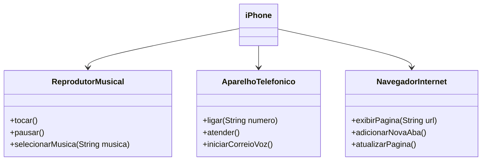

# Modelagem e Diagramação de um Componente iPhone

Este projeto foi desenvolvido para demonstrar a implementação em Java de três funcionalidades principais do iPhone: reprodução de música, funcionamento como aparelho telefônico e navegação na internet. O objetivo é ilustrar o processo de modelagem dessas funcionalidades utilizando um diagrama UML e, em seguida, implementar as classes e métodos correspondentes.

## Descrição do Projeto

1. **Modelagem UML**
   - Um diagrama UML foi criado para representar a estrutura e o comportamento das três funcionalidades principais do iPhone:
     - **Reproduzir Música**: Funcionalidade que permite ao usuário selecionar e reproduzir músicas.
     - **Aparelho Telefônico**: Funcionalidade que simula a realização de chamadas telefônicas.
     - **Navegar na Internet**: Funcionalidade que permite ao usuário acessar a internet e navegar em páginas web.

2. **Implementação em Java**
   - As funcionalidades modeladas no diagrama UML foram implementadas em Java, com uma abordagem orientada a objetos.
   - As funcionalidades foram encapsuladas em classes específicas dentro de uma classe principal `Iphone`, que interage com as funcionalidades descritas.
   - Cada funcionalidade foi implementada como uma classe interna dentro da classe `Iphone`, permitindo que outras classes, como `App`, possam acessar essas funcionalidades através de métodos públicos expostos.

## Estrutura do Código

- `Iphone.java`: Contém a classe principal `Iphone`, que inclui as classes internas responsáveis por cada funcionalidade.
- `App.java`: Classe que interage com o `Iphone` para utilizar as funcionalidades implementadas.

## Ilustração para o diagrama UML

## [DIO](www.dio.me) - Trilha Java Básico - POO - Desafio 
